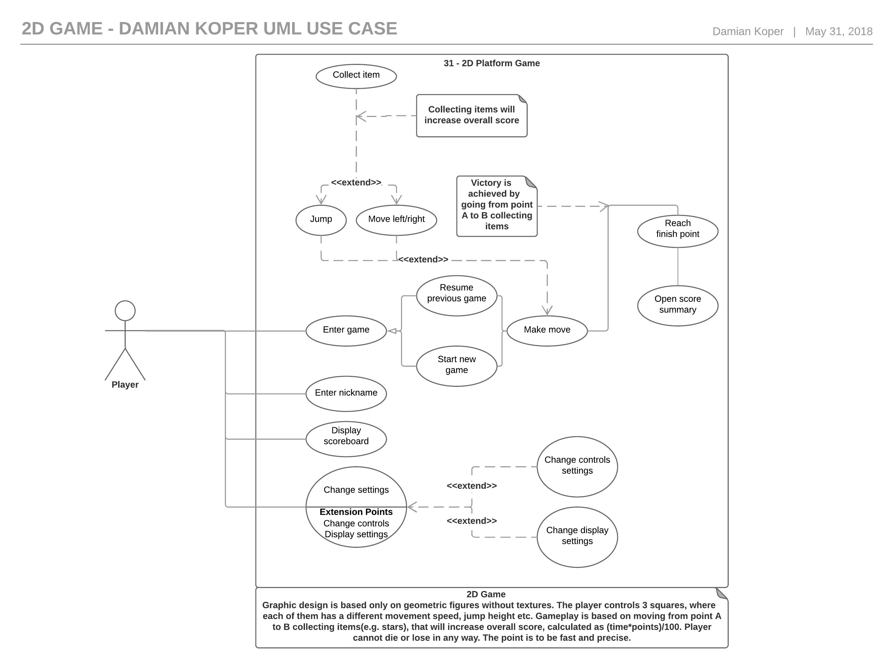
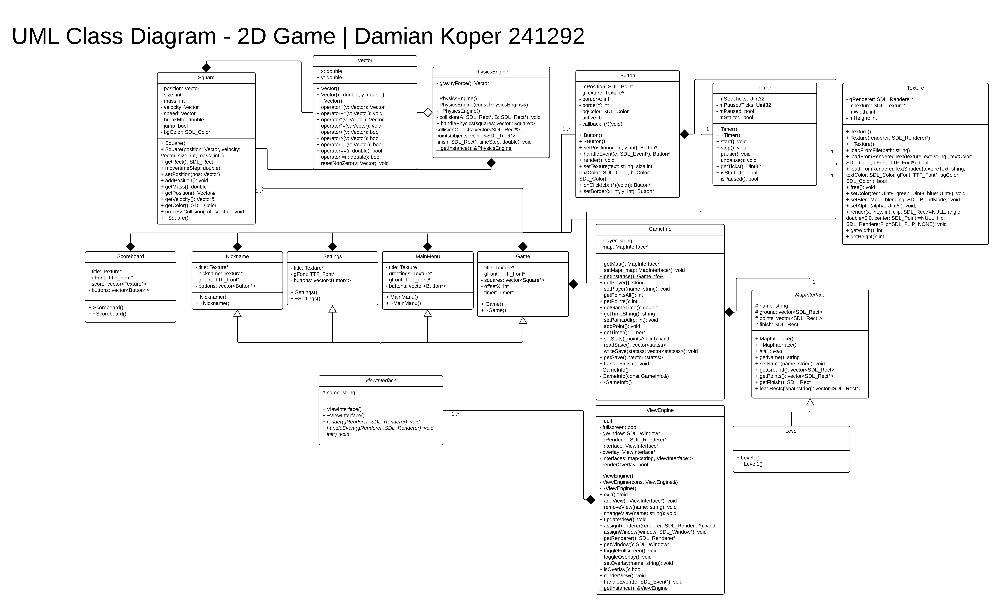
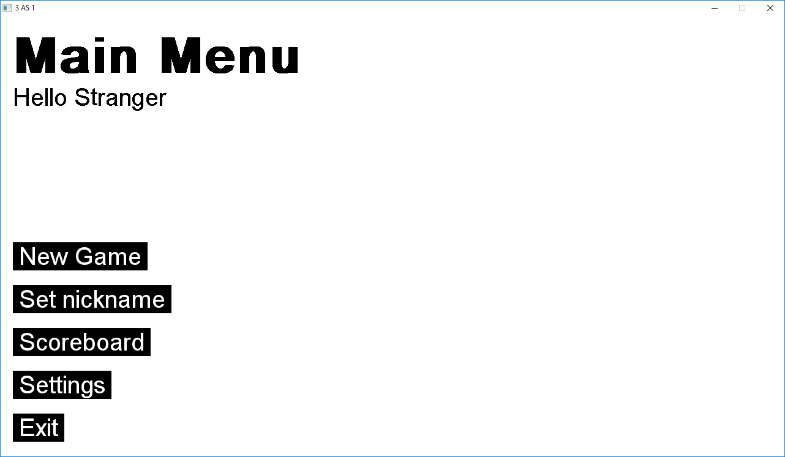
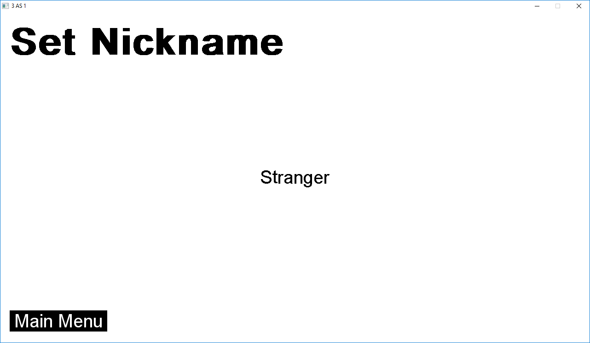
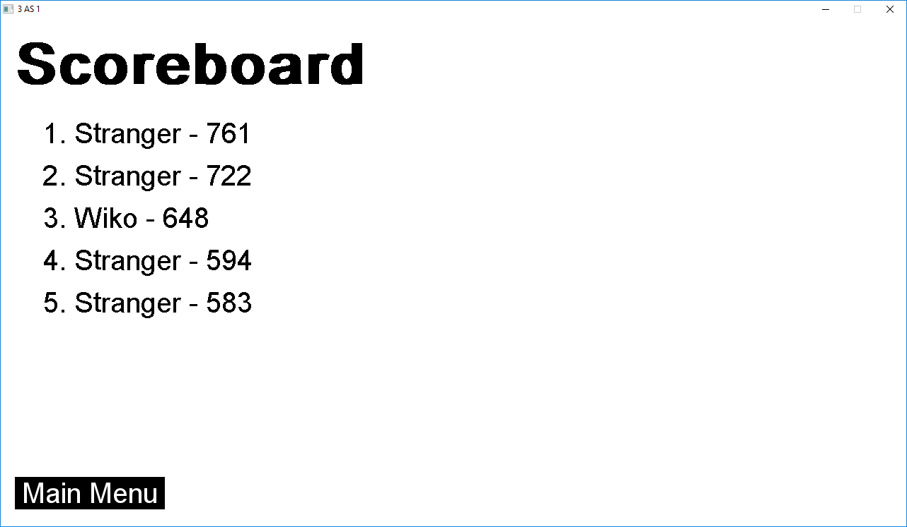
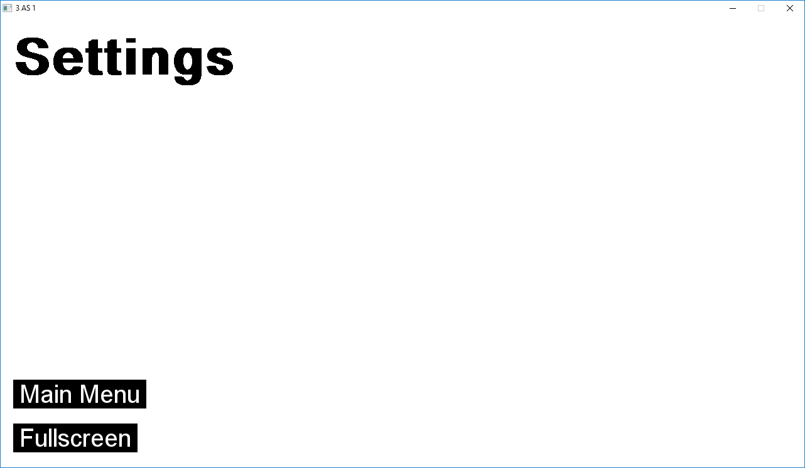
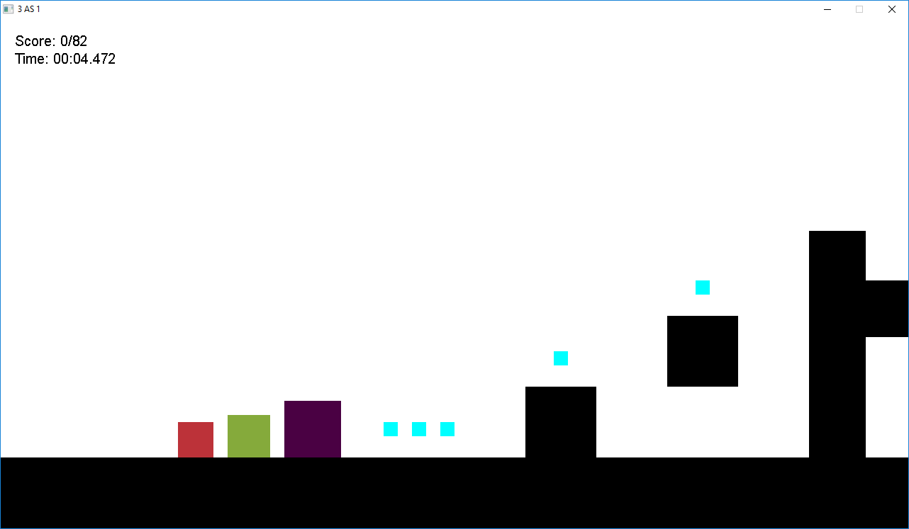
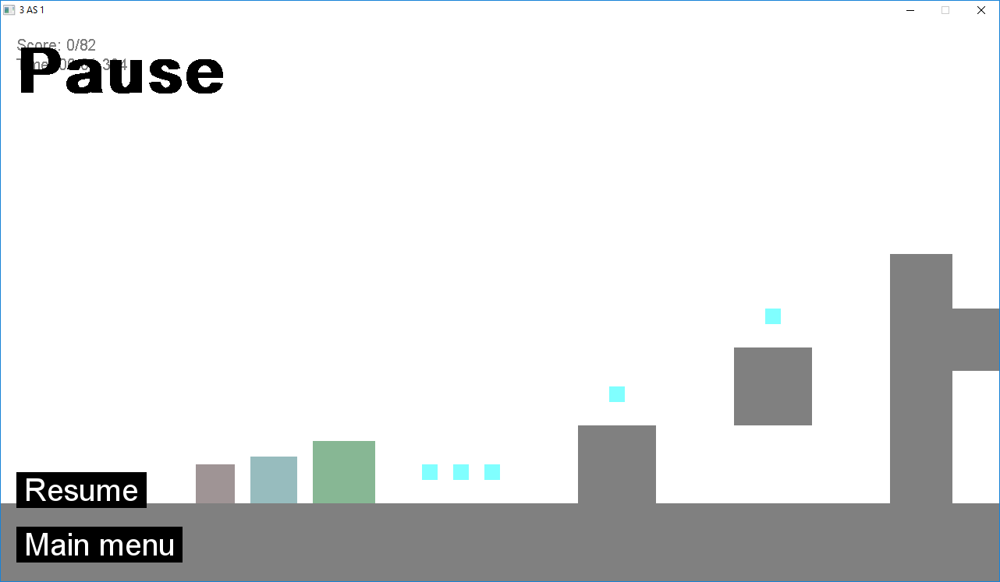
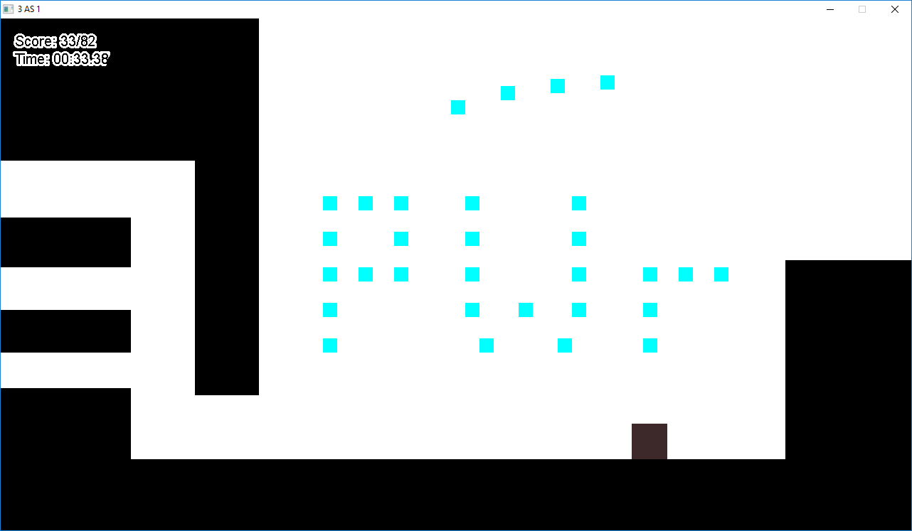

# Programowanie obiektowe - sprawozdanie
## INEW0003P - Projekt
| Wydział Elektroniki | Informatyka |
|---|---|
|Grupa zajęciowa: PO_sr17|Semestr: 2017/18 LATO
|Nazwisko i Imię: Damian Koper|Nr indeksu: 241292|
|Prowadzący: mgr inż. Karol Puchała|

# Temat - Prosta gra 2D
|Ocena|Punkty|Data|
|---|---|---|
|&emsp;&emsp;&emsp;&emsp;&emsp;&emsp;&emsp;|&emsp;&emsp;&emsp;&emsp;&emsp;&emsp;&emsp;|&emsp;&emsp;&emsp;&emsp;&emsp;&emsp;&emsp;&emsp;|
|||

# Założenia i opis funkcjonalny programu
Program jest prostą grą 2D, w której głównym zadaniem gracza jest poruszanie się
trzema kwadratami, sterowanymi za pomocą tych samych przycisków w tym samym czasie, z punktu początkowego do punktu końcowego po drodze zbierając punkty, które potem przekładają się na końcowy wynik obliczany wzorem:
```js
points * exp((-gameTime+2300)/1000.0)
```
Trudność gry polega na wspomnianym sterowaniu wszystkimi trzeba kwadratami jednocześnie. Do ukończenia poziomu wystarczy przemieścić się do punktu końcowego tylko jednym kwadratem, ale po drodze można napotkać trudności z wskoczeniem na niektóre przeszkody, gdzie konieczne jest poświęcenie jednego kwadratu i stworzenie sobie "schodków".

Gra może stanowić wyzwanie dla graczy w dziedzinie *speedruningu*, która to polega na jak najszybszem i najdokłdniejszym przejściu gry, gdyż na wynik końcowy przekłada się czas, jak i ilość zebranych punktów.

Gra pozwala na zmianą trybu wyświetlania na **fullscreen**, oraz na zmianę nazwy gracza, co pozwala na śledzenie i porównywanie wyników kolejnych rozgrywek.

# Diagramy UML
### Diagram przypadków użycia:


### Diagram Klas:


Program jest napisany w całości przeze mnie w środowisku VS Code. Nie użyłem żadnego kreatora, więc diagram stworzonych przeze mnie klas jest dość obszerny.
Pliki w wyższej rozdzielczości można znaleść tutaj: https://github.com/damiankoper/Game_PO_Cpp/tree/master/docs

# Kod klas C++
Projektując strukturę programu wzorowałem się na modelu **MVC**. Za silnik graficzy posłużyła mi biblioteka SDL2. Próbowałem rozdzielić widok, od wejścia i pozostałej logiki aplikacij(modelu).

Każdy widok składa się z trzech funkcji:
1. `init` - inicjalizacja elementów widoku
2. `handleEvent` - obsługa zdarzeń
3. `render` - wyświetlanie widoku

Wykonują się one w głównej pętli aplikacji dla aktualnego widoku (dzięki polimorfizmowi). Wszystkie widoki dziedziczą z klasy ViewInterface i dla łatwości identyfikacji i zmiany rozpoznawane są przez atrybut `name`.

```cpp
class ViewInterface
{
  public:
    virtual void render(SDL_Renderer *gRenderer) = 0;
    virtual void handleEvent(SDL_Event *e) = 0;
    virtual void init() = 0;
    std::string getName();
    void setName(std::string name);
    ViewInterface();
    ~ViewInterface();

  protected:
    std::string name;

};
```

Wszystkimi widokami zarządza klasa `ViewEngine`. Obsługuje ona również całą procedurę renderowania elementów ściśle dla SDLa:

```cpp
class ViewEngine
{
public:
  bool quit;
  void exit();
  void addView(ViewInterface *i);
  void removeView(std::string name);
  void changeView(std::string name);
  void updateView();
  void assignRenderer(SDL_Renderer *renderer);
  void assignWindow(SDL_Window *window);
  SDL_Renderer *getRenderer();
  SDL_Window *getWindow();
  void toggleFullscreen();
  void toggleOverlay();
  void setOverlay(std::string name);
  bool isOverlay();
  void renderView();
  void handleEvent(SDL_Event *e);

  static ViewEngine &getInstance();

private:
  ViewEngine();
  ViewEngine(const ViewEngine &);
  std::map<std::string, ViewInterface *> interfaces;
  ViewInterface *interface = NULL;
  ViewInterface *overlay = NULL;
  bool renderOverlay;
  SDL_Renderer *gRenderer;
  SDL_Window *gWindow;
  bool fullscreen;
};
```
Klasa zarządzająca widokami `ViewEngine`. Z założenia powinna istnieć tylko jedna jej instancja i powinna być ona dostępna we wszystkich widokach/kontrolerach, użyłem więc wzorca **Singleton**.

W danej chwili istnieć (i być dostępna wszędzie) powinna również tylko jedna klasa zarządzająca danymi gry `GameInfo`. To samo tyczy się silnika fizycznego, który obsługuje kolizje i siły działające na obiekty. Kolejno klasy `GameInfo` i `PhysicsEngine`:
```cpp
//pomocnicza struktura przy zapisie do pliku - wyniki graczy
struct statss
{
    int score;
    char name[100];
};

/**
 * Singleton
 */
class GameInfo
{
public:
  std::string getPlayer();
  void setPlayer(std::string name);

  MapInterface* getMap();
  void setMap(MapInterface *_map);

  int getPointsAll();
  int getPoints();
  double getGameTime();
  std::string getTimeString();
  void setPointsAll(int p);
  void addPoint();
  Timer* getTimer();
  void setStats(int _pointsAll);
  std::vector<statss> readSave();
  void writeSave(std::vector<statss> statsss);
  std::vector<statss> getSave();

  void handleFinish();
  static GameInfo &getInstance();

private:
  GameInfo();
  GameInfo(const GameInfo &);
  std::string player;
  std::vector<statss> bestScore;
  int points;
  int pointsAll;
  Timer *gameTimer;

  MapInterface *map;
};
```

```cpp
/**
 * Singleton
 */
class PhysicsEngine
{
public:
  static PhysicsEngine &getInstance();
  void handlePhysics(std::vector<Square *> squares,
                     std::vector<SDL_Rect *> collisionObjects,
                     std::vector<SDL_Rect *> *pointsObjects,
                     SDL_Rect *finish,
                     double timeStep);

private:
  PhysicsEngine();
  PhysicsEngine(const PhysicsEngine &);
  Vector collision(SDL_Rect *A, SDL_Rect *B);
  Vector gravityForce;
};
```

W celu zbudowanie UI stworzyłem też klasę przycisku `Button`, której jednym z parametrów jest wskaźnik na funkcję, która ma się wykonać po naciśnięciu przycisku. Użyłem tu też *method chaining*, co znacznie ułatwia konfigurację. Jako kontrolka umieszczona w widoku przycisk ma swoje metody `render()` i `handleEvent()`, które wywoływane są w widoku:
```cpp
class Button
{
public:
  Button();
  Button *setPosition(int x, int y);
  Button *handleEvent(SDL_Event *e);
  void render();
  Button *setTexture(std::string text, int size, SDL_Color, SDL_Color _bgColor);
  Button *onClick(void (*cb)(void));
  Button *setBorder(int x, int y);

private:
  SDL_Point mPosition;
  Texture *gTexture;

  int borderX;
  int borderY;

  SDL_Color bgColor;

  bool active;

  void (*callback)(void); //click callback function
};
```
Stworzenie klasy Vector z przeładowanymi operatorami ułatwiło mi obliczenia pozycji, kolizji itd:
```cpp
class Vector
{
  public:
    Vector();
    Vector(double x, double y);
    Vector operator+(const Vector v);
    Vector operator+=(const Vector v);
    Vector operator*(const int i);
    Vector operator*(const double i);
    Vector operator/(const double i);
    bool operator==(const Vector v);
    bool operator==(const double i);
    bool operator!=(const int i);
    void resetNonZero(Vector v);
    bool operator<(const Vector v);
    double x, y;
};
```
Klasa bohatera - kwadratu zawiera wszystkie niezbędne atrybuty określające położenie, jak i jego właściwości fizyczne. Zawiera również metody odpowiedzialne za ruch i regowanie na kolizje:
```cpp
class Square
{
public:
  Square();
  Square(Vector position, Vector speed, int size, int mass, double breakMtp, int accTime);
  SDL_Rect getRect();
  void move();
  void addPosition(double timeStep);
  double getMass();
  Vector &getPosition();
  Vector &getVelocity();
  SDL_Color getColor();
  void processCollision(Vector coll);
  ~Square();

private:
  Vector velocity;
  Vector position;
  int size;
  double mass;
  Vector speed;
  double breakMtp;
  int accTime;
  bool jump;
  SDL_Color bgColor;
};
```
Dalej pozostają klasy, które obudowują potrzebne funkcje SDLa, takie jak `Texture` i `Timer`, których listing kodu tutaj nic by nie wniósł.

Klasy wszystkich widoków wyglądają podobnie. Umieszczam klasę `MainMenu`:
```cpp
class MainMenu : public ViewInterface
{
public:
  MainMenu();
  ~MainMenu();
  void render(SDL_Renderer *gRenderer);
  void handleEvent(SDL_Event *e);
  void init();

private:
  Texture *title;
  Texture *greetings;
  TTF_Font *gFont;
  std::vector<Button *> buttons;
};
```
Jak widać w prywatnych zmiennych znajdują się elementy widoku takie jak napisy, potrzebne czcionki i przyciski.

Jedynym znacząco różniącym się widokiem jest widok samej gry, gdzie zostały dodane metody odpowiedzialne za pracę *kamery* (offset OX):
```cpp
class Game : public ViewInterface
{
public:
  Game();
  ~Game();
  void render(SDL_Renderer *gRenderer);
  void handleEvent(SDL_Event *e);
  void init();
  Square* maxRight();
  void calculateOffset();


private:
  TTF_Font *gFont;
  TTF_Font *gFontOutline;
  Texture *time;
  Texture *points;
  Timer *timer;
  int offsetX;
  int border;
  std::vector<Square *> squares;
};
```

Mapa gry zbudowana jest wyłączcnie z prostokątów. Myśląc przyszłościowo stworzyłem również klasę bazową poziomu i chciałem dziedziczyć różne rodzaje poziomów, jednak brak czasu i kompleksowość obecnych rozwiązań odwiodły mnie od rozbudowy tej idei.
```cpp
class MapInterface
{
public:
  virtual void init() = 0;
  std::string getName();
  void setName(std::string name);

  std::vector<SDL_Rect *> loadRects(std::string what);
  std::vector<SDL_Rect *> getGround();
  std::vector<SDL_Rect *> *getPoints();
  SDL_Rect *getFinish();

  MapInterface();
  ~MapInterface();

protected:
  std::string name;
  //Map geometry
  std::vector<SDL_Rect *> ground;
  std::vector<SDL_Rect *> points;
  SDL_Rect *finish;
};
```
Klasa ta odpowiedzialna jest za wczytywanie danynch mapy z pliku zgodnego z formatem:
```
-600, 620, 24000, 100
-600, 0, 100, 1000
500, 520, 100, 100
700,  420, 100, 100
900,  370, 400, 80
900,  300, 80, 400
1600, 200, 90, 300
...
```
Są to pozycje i wymiary prostokątów tworzących mapę. Podczas debugowania i tworzenia mapy odczytywałem plik co cykl głównej pętli programu, co dało efekt rzeczywistego podglądu zmian.

Główna pętla programu, po uproszczniu wygląda tak:
```cpp 
while (!ViewEngine::getInstance().quit)
{
    while (SDL_PollEvent(&e) != 0) 
    {
        ViewEngine::getInstance().handleEvent(&e);
    }

    ViewEngine::getInstance().renderView();
}
```

# Opis użytkowy programu

Menu główne jest logicznie skonstruowane. Na górze wyświetla się nick gracza:



Nick można zmienić klikając w **Set nickname**:



Gracze mogą zobaczyć swoje 5 najlepszych wyników w sekcji **Scoreboard**:



Jedyną dostępną opcją w menu **Settings** jest przełączenie ekranu w tryb fullscreen:



## Gra

Po kliknięciu na przycisk **New game** gracz zobaczy początkową część poziomu z trzema kwadratami o losowych kolorach. Turkusowe kwadraciki są punktami, których, jak można zobaczyć w lewym górnym rogu ekranu, w całym poziomie występuje 82:



Z każdego miejsca poziomu gracz, po wciśnięciu klawisza **ESC**, zostanie przeniesiony do menu pauzy, skąd może wznowić grę albo wyjśc do menu głónego bez zapisywania stanu gry:



Znalazło się również miejsce, by wspomnieć o naszej kochanej uczelni:



# Listing kodu C++/Python
Cały kod został napisany przeze mnie i wszystkie pliki dostępne są pod adresem:
https://github.com/damiankoper/Game_PO_Cpp/tree/master/src

https://github.com/damiankoper/Game_PO_Python/tree/master/src

SDL2 w Pythonie ma odzworowanie 1:1 jako biblioteka PySDL2. Logika i struktura aplikacji pozostała niezmieniona.

# Wnioski
Udało mi się zapogramować większość zaplanowanych przeze mnie funkcjonalności. Jedną z rzeczy, których nie udało się zrobić jest zmiana ustawień strowania. Oczywiście po czasie widać, że część kodu wymaga refrectoringu, jednak nie mam w planach rozwijania tego projektu. Powiniennem był bardziej trzymać się moich założeń maksymalnego zagnieżdżania logiki renderowania i obsługi zdarzeń, czego nie widać w widoku `Game`, gdzie ręcznie renderuję elementy mapy, jak i same kwadraty. Wybrałbym również bibliotekę SFML zamiast SDL, która to ma już zaimplementowane elementy takie jak wektory i timery. Zdecydowałem się na SDL gdyż moja wiedza na temat SFMLa była mniejsza, oraz z uwagi na fakt posiadania przez PySDL dobrej dokumentacji i odwzorowania 1:1 co znacząco skróciło etap przepisywania programu na drugi język, a co było moim głównym celem. Rozwój projektu mógłby operać się na rozbudowie elementów platformowych, dodanie elementów ruchomych, rozwój silnika fizycznego - użyciu na przykład **Box2D**.